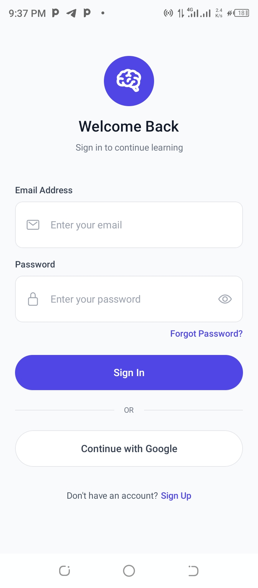
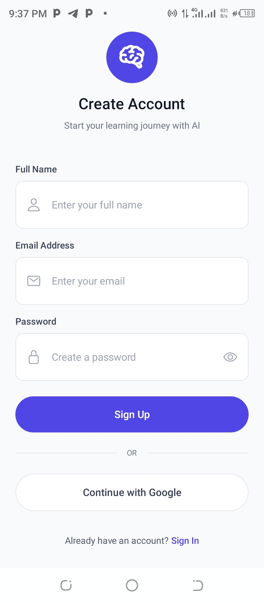
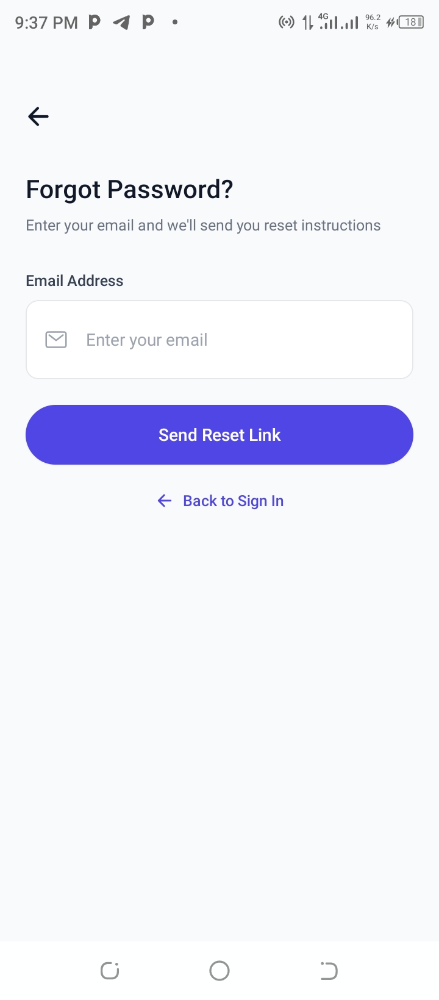
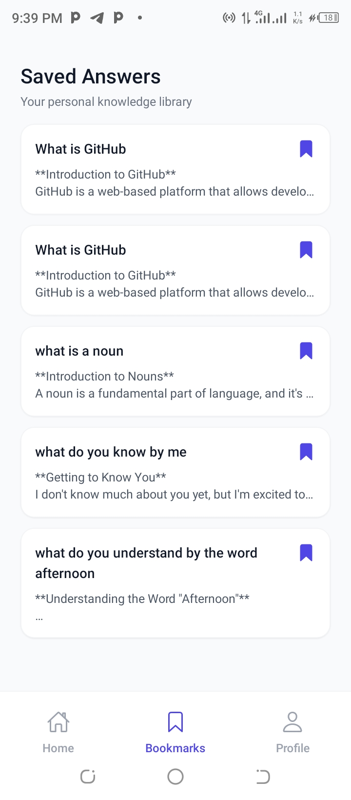
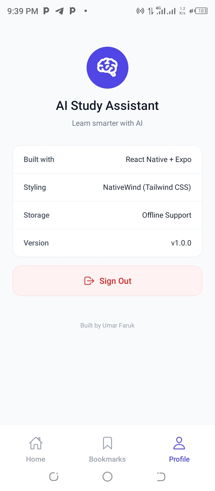

# 🧠 AI Study Assistant

A modern, AI-powered mobile study assistant built with React Native and Expo. Ask questions, get instant AI-generated answers, and save your favorite study materials for later review.


## ✨ Features

- 🤖 **AI-Powered Answers** - Get instant, educational answers to any question using Groq's LLaMA AI
- 🔖 **Smart Bookmarks** - Save and organize your favorite answers for quick reference
- 🔐 **Secure Authentication** - Email/password authentication with Firebase
- 🎤 **Voice Input** - Ask questions hands-free with speech-to-text (coming soon)
- 💾 **Offline Storage** - Access saved answers even without internet
- 🎨 **Modern UI** - Clean, intuitive interface with smooth animations
- 🌙 **Dark Mode Ready** - Comfortable viewing in any lighting condition

## 📱 Screenshots

<div align="center">

### Authentication Screens
  

### Main App Screens
   


</div>

## 🛠️ Tech Stack

### Frontend
- **React Native** - Cross-platform mobile development
- **Expo** - Development and build tooling
- **TypeScript** - Type-safe code
- **NativeWind** - Tailwind CSS for React Native
- **Expo Router** - File-based navigation

### Backend & Services
- **Firebase Authentication** - User authentication
- **Groq AI** - Fast, free AI completions (LLaMA 3.3 70B)
- **AsyncStorage** - Local data persistence

### State Management
- **Zustand** - Lightweight state management

### Additional Libraries
- **expo-speech-recognition** - Voice input
- **@expo/vector-icons** - Icon library
- **react-native-safe-area-context** - Safe area handling

## 🚀 Getting Started

### Prerequisites

- Node.js 18+ installed
- npm or yarn package manager
- Expo CLI (`npm install -g expo-cli`)
- iOS Simulator (Mac) or Android Studio (for emulator)
- Groq API key ([Get one here](https://console.groq.com/))
- Firebase project ([Setup guide](https://firebase.google.com/))

### Installation

1. **Clone the repository**
```bash
git clone https://github.com/yourusername/ai-study-assistant.git
cd ai-study-assistant
```

2. **Install dependencies**
```bash
npm install
```

3. **Create environment file**

Create a `.env` file in the root directory:

```env
# Groq AI API Key
EXPO_PUBLIC_GROQ_API_KEY=your_groq_api_key_here

# Firebase Configuration
EXPO_PUBLIC_FIREBASE_API_KEY=your_firebase_api_key
EXPO_PUBLIC_FIREBASE_AUTH_DOMAIN=your-app.firebaseapp.com
EXPO_PUBLIC_FIREBASE_PROJECT_ID=your-project-id
EXPO_PUBLIC_FIREBASE_STORAGE_BUCKET=your-app.appspot.com
EXPO_PUBLIC_FIREBASE_MESSAGING_SENDER_ID=123456789
EXPO_PUBLIC_FIREBASE_APP_ID=1:123456789:web:abcdef
```

4. **Start the development server**
```bash
npx expo start
```

5. **Run on device/emulator**
- Press `i` for iOS simulator
- Press `a` for Android emulator
- Scan QR code with Expo Go app for physical device

## 🔧 Configuration

### Firebase Setup

1. Go to [Firebase Console](https://console.firebase.google.com/)
2. Create a new project
3. Enable Authentication → Email/Password
4. Copy your Firebase config to `.env` file

### Groq API Setup

1. Sign up at [Groq Console](https://console.groq.com/)
2. Create an API key
3. Add to `.env` file

## 📁 Project Structure

```
ai-study-assistant/
├── app/                    # App screens (Expo Router)
│   ├── (auth)/            # Authentication screens
│   │   ├── sign-in.tsx
│   │   ├── sign-up.tsx
│   │   └── forgot-password.tsx
│   ├── (tabs)/            # Main app tabs
│   │   ├── index.tsx      # Home screen
│   │   ├── bookmarks.tsx  # Bookmarks screen
│   │   └── profile.tsx    # Profile screen
│   ├── answer.tsx         # Answer detail screen
│   └── _layout.tsx        # Root layout
├── components/            # Reusable components
│   ├── screens/          # Screen components
│   ├── Icons.tsx         # Icon system
│   └── VoiceButton.tsx   # Voice input button
├── stores/               # Zustand state management
│   ├── useAuthStore.ts   # Auth state
│   └── useQuestionStore.ts # Questions state
├── services/             # API services
│   ├── aiService.ts      # Groq AI integration
│   └── authService.ts    # Firebase auth
├── config/               # Configuration
│   └── firebase.ts       # Firebase config
├── hooks/                # Custom hooks
│   └── useVoiceInput.ts  # Voice input hook
├── utils/                # Utility functions
└── assets/              # Images, fonts, etc.
```

## 🎯 Key Features Explained

### AI-Powered Q&A
The app uses Groq's LLaMA 3.3 70B model to provide fast, accurate answers to study questions. The AI is configured to give educational, clear, and concise responses perfect for learning.

### Smart Bookmarking
Users can save answers to their local device for offline access. Bookmarks are stored using AsyncStorage and persist across app restarts.

### Secure Authentication
Firebase Authentication handles user accounts with email/password login. Sessions persist automatically, so users stay logged in between app sessions.

### State Management
Zustand provides lightweight, performant state management without boilerplate. Auth state and question history are managed globally.

## 🎨 Customization

### Change Theme Colors

Edit the primary color in your components:

```typescript
// Current: Indigo (#4F46E5)
// Change to your brand color throughout the app
className="bg-indigo-600" // Change indigo-600 to your color
```

### Modify AI Behavior

Edit the system prompt in `services/aiService.ts`:

```typescript
{
  role: "system",
  content: "Your custom instructions here..."
}
```

### Add New AI Models

Groq supports multiple models. Change in `aiService.ts`:

```typescript
model: "llama-3.3-70b-versatile", // Best quality
// or
model: "llama-3.1-8b-instant",    // Fastest
// or
model: "mixtral-8x7b-32768",      // Long context
```

## 🧪 Testing

```bash
# Run tests (if configured)
npm test

# Type checking
npx tsc --noEmit

# Linting
npm run lint
```

## 📦 Building for Production

### Development Build (with native features)
```bash
eas build --profile development --platform ios
eas build --profile development --platform android
```

### Production Build
```bash
# iOS
eas build --platform ios

# Android
eas build --platform android
```

## 🚢 Deployment

### iOS App Store
1. Build production app: `eas build --platform ios`
2. Submit to App Store: `eas submit --platform ios`
3. Follow App Store Connect review process

### Google Play Store
1. Build production app: `eas build --platform android`
2. Submit to Play Store: `eas submit --platform android`
3. Follow Google Play Console review process

## 🤝 Contributing

Contributions are welcome! Please follow these steps:

1. Fork the repository
2. Create a feature branch (`git checkout -b feature/AmazingFeature`)
3. Commit your changes (`git commit -m 'Add some AmazingFeature'`)
4. Push to the branch (`git push origin feature/AmazingFeature`)
5. Open a Pull Request

### Contribution Guidelines

- Follow the existing code style
- Write meaningful commit messages
- Add tests for new features
- Update documentation as needed
- Ensure all tests pass before submitting PR

## 📝 License

This project is licensed under the MIT License - see the [LICENSE](LICENSE) file for details.

## 👨‍💻 Author

**Umar Faruk Shehu**
- GitHub: [Ushehu](https://github.com/Ushehu)
- Email: ushehu132@gmail.com

## 🙏 Acknowledgments

- [Groq](https://groq.com/) - For providing fast, free AI completions
- [Firebase](https://firebase.google.com/) - For authentication services
- [Expo](https://expo.dev/) - For amazing developer experience
- [React Native](https://reactnative.dev/) - For cross-platform mobile development

## 📞 Support

If you have any questions or need help, please:

1. Check the [Issues](https://github.com/yourusername/ai-study-assistant/issues) page
2. Create a new issue with detailed information
3. Reach out via email

## 🗺️ Roadmap

- [x] Basic Q&A functionality
- [x] User authentication
- [x] Bookmark system
- [x] AI integration with Groq
- [ ] Voice input (in progress)
- [ ] Quiz generation
- [ ] Study statistics
- [ ] Dark mode
- [ ] Share answers
- [ ] PDF upload & chat
- [ ] Flashcard generation
- [ ] Study reminders
- [ ] Collaborative study groups

## ⭐ Show your support

Give a ⭐️ if this project helped you!

---

<div align="center">
  <sub>Built with ❤️ by Umar Faruk shehu</sub>
</div>
